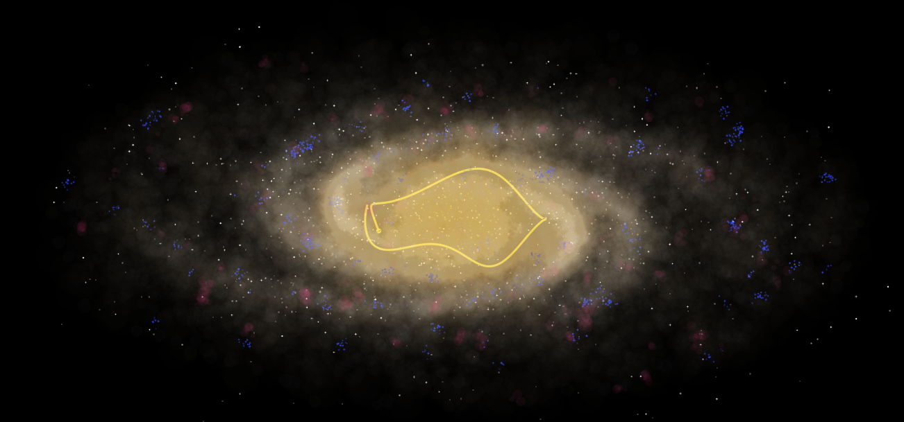

#### Visualization of the dynamics of the Milky Way spiral arm galaxy 

The project is a visualization (with a lot of physical motivation) of the Milky Way. The animation is generated with the GLMakie package on Julia. 

It includes two sets of spiral arms, a 2-arm set roughly co-rotating with the solar system, and a 4-armed spiral arm set having a rotation period of around 600 Myr, which extends from the solar circle outwards. 

The animation also includes the solar orbit (with the z-axis oscillation amplitude exaggerated for the visualization).

 